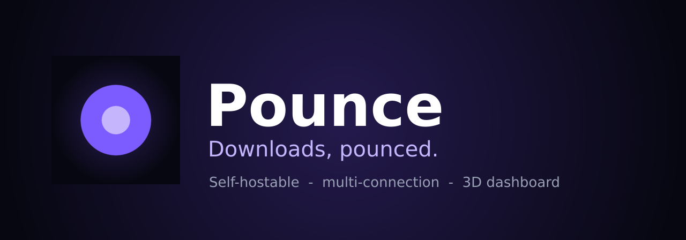
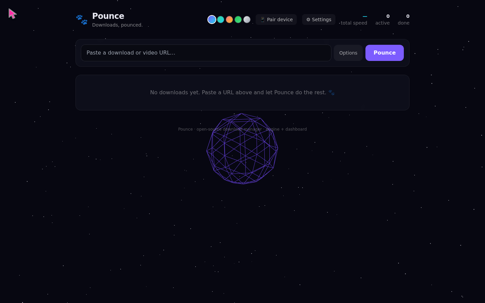

<div align="center">



# 🐾 Pounce

### Downloads, pounced.

A **download engine you host and fully own** — permanent **resume**, **multi-connection acceleration**, live **speed control**, an immersive **3D dashboard**, and optional **browser capture**. Run it on your laptop, home server, or NAS and drive it from any browser. 100% open source (MIT).

[](https://github.com/0xheycat/pounce/actions/workflows/ci.yml)
[](CHANGELOG.md)
[-00ADD8)](engine/)
[](dashboard/)
[](LICENSE)
[](https://0xheycat.xyz/work/pounce)

</div>

---

## 📸 Dashboard

<div align="center">



</div>

The screenshot is captured from the actual Vite dashboard at the repository's verified public-readiness head. The dashboard works without a paid service; API and live-download data come from the self-hosted Go engine.

## Why Pounce?

Most of us still lose downloads to a dropped connection, a closed tab, or a reboot — and the tools that fix that are often desktop-only or tied to a single machine. Pounce takes a different angle: it's a small engine **you run yourself** that does the real downloading — splitting files across many connections, persisting per-segment progress to disk, and resuming exactly where it left off, even after a restart — controlled from a beautiful **3D web dashboard** you can open from any device on your network.

Think of it less as "an app" and more as **your own personal download service**: self-hosted, always-on if you want it, and entirely yours.

## What makes Pounce different

- 🏠 **Self-hostable by design** — one engine, reachable from your laptop, phone, or another machine. Your files and history never leave your hardware.
- 🪶 **Single static binary, zero runtime deps** — the engine is pure Go standard library. No Electron, no JVM, no background bloat. Drop it on a Raspberry Pi or a NAS and go.
- 🌐 **Browser, not a desktop install** — the UI is a web dashboard, so the same Pounce works on every OS and every screen.
- 🔌 **Hackable & extensible** — a clean REST + SSE API and a small codebase meant to be read and forked.
- 🎨 **Actually nice to look at** — a full-3D, themeable dashboard, because tools you use daily should feel good.

These aren't reinventions — they're a combination aimed at one goal: **a download manager anyone can run, own, and trust, for free.**

## Built on the shoulders of giants

Pounce exists thanks to the people who pioneered this space. Tools like **aria2**, **yt-dlp**, **JDownloader**, and others shaped what a download manager can be — and Pounce is our open contribution back to that lineage, not a replacement for any of them. Where it helps, Pounce is designed to *cooperate* (for example, resolving media via yt-dlp) rather than compete. If another tool serves you better, use it — and we'd love to learn from it. 🐾

## 📱 Pounce Anywhere — your downloads, on every device

Because Pounce is a service you host, you can drive it from anywhere — your phone on the couch, a laptop in another room, or across the internet through your own tunnel. This is the part most download managers can't do.

- **One-command remote mode:** `pounce --remote` binds every interface and requires a token (auto-generated and printed at startup).
- **One-tap phone pairing:** the engine prints a ready-to-open link with the token baked in, and the dashboard's **📱 Pair device** panel shows a **QR code** — scan it and you're in.
- **Install it like an app:** the dashboard is a **PWA** — "Add to Home Screen" for a full-screen, offline-aware Pounce.
- **Secure by default:** remote access always needs a bearer token; for internet exposure, put Pounce behind HTTPS (Caddy/nginx) or a private tunnel (Tailscale/Cloudflare Tunnel).

Full setup, including reverse-proxy and tunnel recipes: [`docs/REMOTE.md`](docs/REMOTE.md).

## Features

### Working today (v0.1)
- ⚡ **Multi-connection, segmented downloads** — HTTP `Range` requests, up to 32 parallel streams.
- 🔁 **Permanent resume** — per-segment progress is persisted; resume survives app/PC restarts.
- ⏸️ **Pause / resume / cancel** — partial data is never thrown away on pause.
- 🎛️ **Live speed limiting** — token-bucket throttle, adjustable per download on the fly.
- 📁 **Choose save location** — the engine has real filesystem access (unlike a browser).
- 📡 **Range/Accept-Ranges detection** — gracefully falls back to single-stream when a server won't cooperate.
- 🌌 **Full 3D dashboard** — orbiting progress orbs, glow that tracks throughput, live stats, glassmorphism UI.
- 🔌 **Zero-dependency engine** — pure Go standard library; builds to a single binary.

### On the roadmap (scaffolded — great first contributions)
- 🎬 Video/stream capture via **yt-dlp**
- 🥲 **Torrent / magnet** support via aria2
- 🗓️ **Scheduler** + bandwidth profiles, auto-shutdown
- 🧩 **Browser extension** link capture (MV3 scaffold included)
- 📱 **Remote access** from phone + auth
- 🗄️ SQLite store backend, checksum verification, mirror/multi-source

See [`docs/ROADMAP.md`](docs/ROADMAP.md).

## Architecture

```
Browser ─► 3D Dashboard (React + R3F)
            │  REST + Server-Sent Events
            ▼
     Local Engine (Go daemon, :7766)
     segmented │ resume │ throttle │ queue │ SSE
            │
     ~/.pounce/meta/*.json   (+ .pdownload part files)
```

Full write-up: [`docs/ARCHITECTURE.md`](docs/ARCHITECTURE.md).

## Quick start

### 0. Docker — zero local toolchain (easiest way to test)
No Go or Node installed? Build and run everything with just Docker:
```bash
docker compose up --build      # then open http://localhost:7766
# ...or without compose:
docker build -t pounce:local . && docker run --rm -p 7766:7766 pounce:local
```
Prefer `make`? Run `make docker && make docker-run`. For contributors with Go + Node, `make build` / `make test` / `make run` cover the rest.

### 1. Run the engine
```bash
cd engine
go run ./cmd/pounce            # listens on http://127.0.0.1:7766
```

### 2. Run the dashboard (dev)
```bash
cd dashboard
npm install
npm run dev                    # http://localhost:5173 (proxies to the engine)
```

### 3. Production (single process)
Build the dashboard, then let the engine serve it:
```bash
cd dashboard && npm install && npm run build
cd ../engine && go run ./cmd/pounce --static ../dashboard/dist
# open http://127.0.0.1:7766
```

### Engine flags
| Flag | Default | Description |
|------|---------|-------------|
| `--addr` | `127.0.0.1:7766` | Listen address |
| `--data` | `~/.pounce` | State directory (resume metadata) |
| `--static` | _(none)_ | Path to built dashboard `dist` to serve |
| `--auth-token` | _(none)_ | Require this bearer token on `/api` routes |
| `--remote` | `false` | Bind all interfaces + require a token (auto-generated if unset); prints device-pairing links |

## REST API (brief)
| Method | Path | Body | Description |
|--------|------|------|-------------|
| GET | `/api/downloads` | — | List downloads |
| POST | `/api/downloads` | `{ url, dir?, connections?, speedLimit? }` | Add + start |
| POST | `/api/downloads/{id}/pause` | — | Pause |
| POST | `/api/downloads/{id}/resume` | — | Resume |
| POST | `/api/downloads/{id}/cancel` | — | Cancel + delete partial |
| POST | `/api/downloads/{id}/speed` | `{ limit }` | Set speed limit (bytes/s, 0 = unlimited) |
| DELETE | `/api/downloads/{id}` | — | Remove from list |
| GET | `/api/events` | — | SSE live updates |

## Contributing

PRs welcome! Pounce is intentionally small and modular so it's easy to extend. Start with [`CONTRIBUTING.md`](CONTRIBUTING.md) and the roadmap's “good first issue” ideas.

## License

[MIT](LICENSE) © Pounce contributors.

> ⚠️ Use responsibly. Only download content you have the right to access; respect copyright, site terms, and local law.
